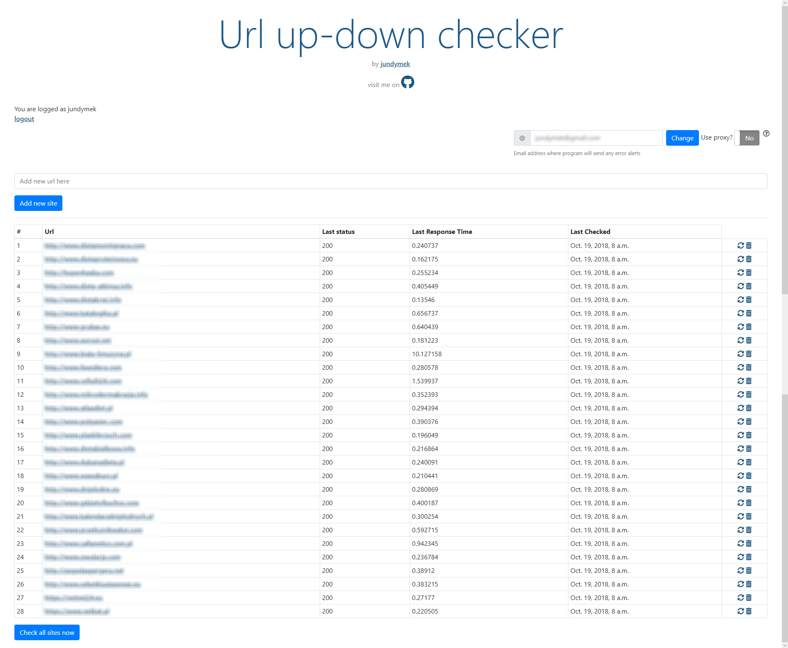
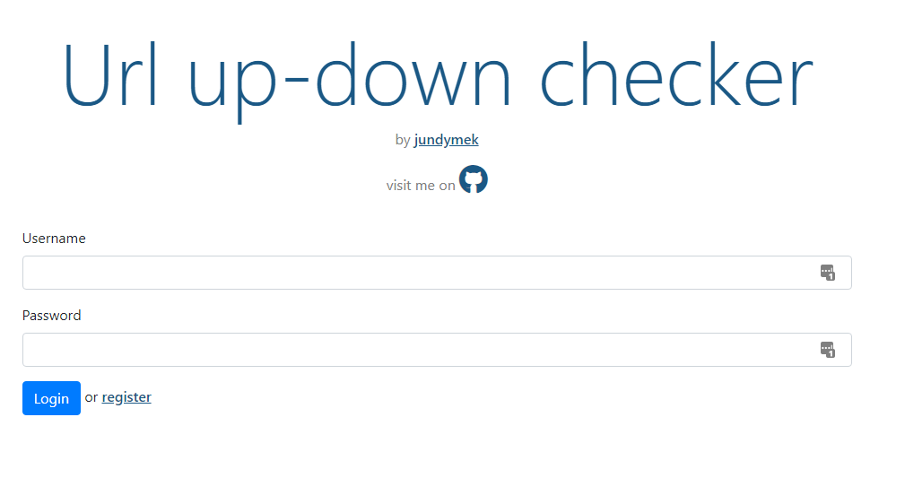
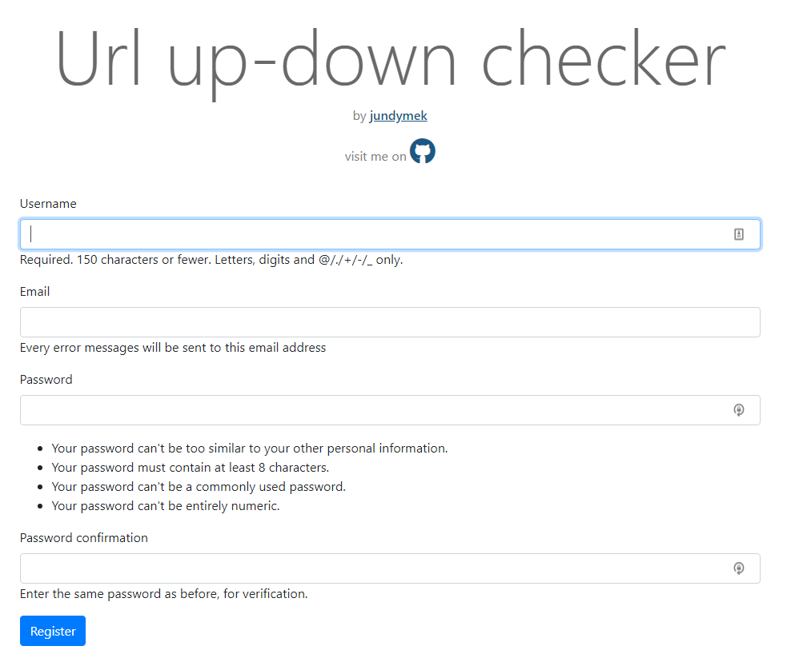
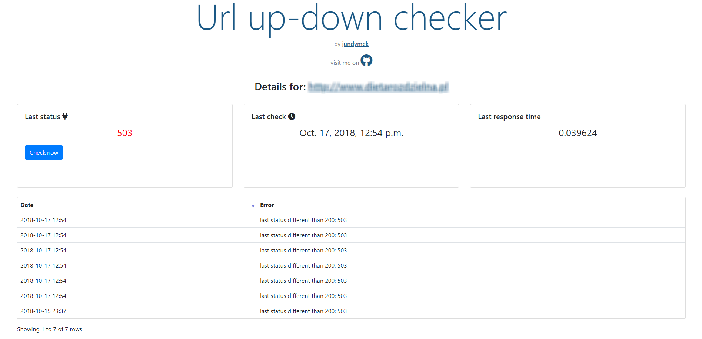
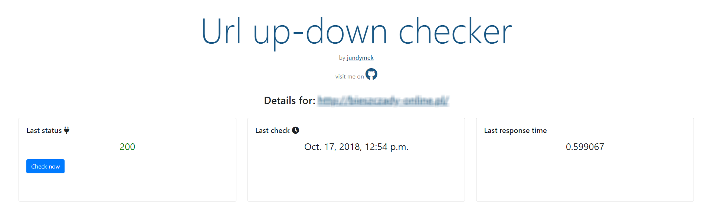

# Site-down-checker

A simple web application to monitor HTTP statuses of your websites. You can manually add URLs and monitor them with cron jobs.

If you have a lot of different sites and you can't check them manually it is a script for you. I wrote site-down-checker for myself (there was a time when I had got about 100 hundred websites and I couldn't check their activity manually). Now I am able to monitor all my sites without any issues. Most important is I get emails when something is going wrong with any of my websites and I can react as quickly as possible.

Feel free to use my code for your purpose. 

# Selected functions

* Adding/removing URLs to/from a database

* Adding new users

* Testing HTTP responses daily (cron jobs)

* Sending emails with error warnings

* Optionally use a random proxy to sending requests

# Screenshots

### Main page

### Login page

### Registration page

### Details page (detected errors) 

### Details page (without errors - only status 200)

